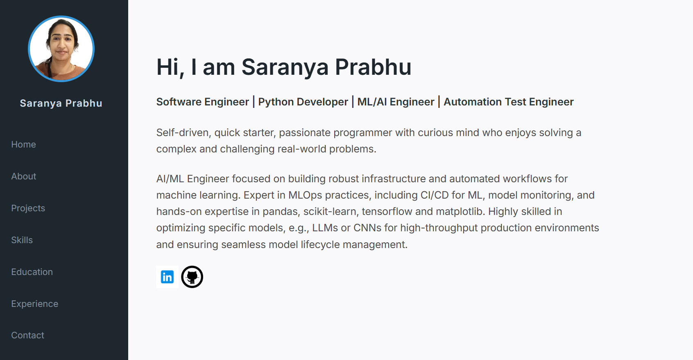

# Saranya Prabhu | Personal Portfolio ⚡️ 
 A clean, minimalist and fully responsive portfolio website built to showcase my journey as a developer/tester. This site features my professional summary, technical skills, projects, education, experience and contact information.

[Live Demo](https://saraprabs.github.io)

---

## 🚀 Features

* **Responsive Design:** Fully optimized for Desktop, Tablet, and Mobile screens.
* **Dynamic Navigation:** A fixed sidebar that smoothly transitions to a top-header on mobile devices.
* **Interactive UI:** Content updates dynamically via JavaScript without page reloads.
* **Clean Typography:** Using Inter and Lora Google Fonts for a professional look.
* **Social Connectivity:** Integrated icons for GitHub and Email with custom tooltips.

## 🛠️ Tech Stack

* **HTML5:** Semantic structure.
* **CSS3:** Custom Flexbox layout, Media Queries, and Hover animations.
* **JavaScript:** DOM manipulation for section switching and interactive elements.
* **GitHub Pages:** Automated deployment and hosting.

## 📂 Project Structure

```text
├── images/             # Profile picture and screenshot
├── logos/              " Social icons and logos
├── index.html          # Main entry point
├── style.css           # Custom styling and responsive queries
├── script.js           # Navigation logic
└── README.md           # Project documentation
```
## 📸 Preview
[!TIP]

This portfolio uses a "Single Page Application" approach where clicking the sidebar links updates the #main-view area dynamically!

#### Built with ❤️ by Saranya Prabhu